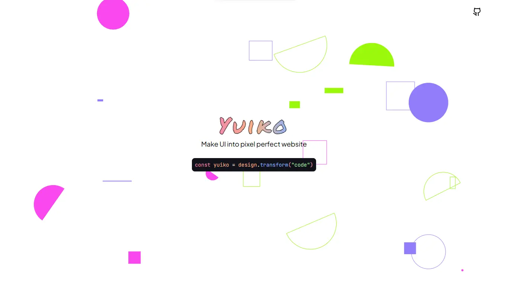

# Yuiko

Make beautiful UI into pixel perfect website.

## About Yuiko

Yuiko is my old project initiated from my pal [Elianiva](https://github.com/elianiva) and [Nikarashihatsu](https://github.com/nikarashihatsu) to increase my HTML CSS Skills by taking UI from dribbble or anywhere and convert it into a website anyone can visit.

This project was abandoned by me in 2021 because i feel like my CSS skill is "good enough", and now i remake it to refreshed my CSS Skill.

This project will be updated weekly, maybe.

And my designing skill is suck somehow, i'm not color blind, i'm just suck and designing thing.
